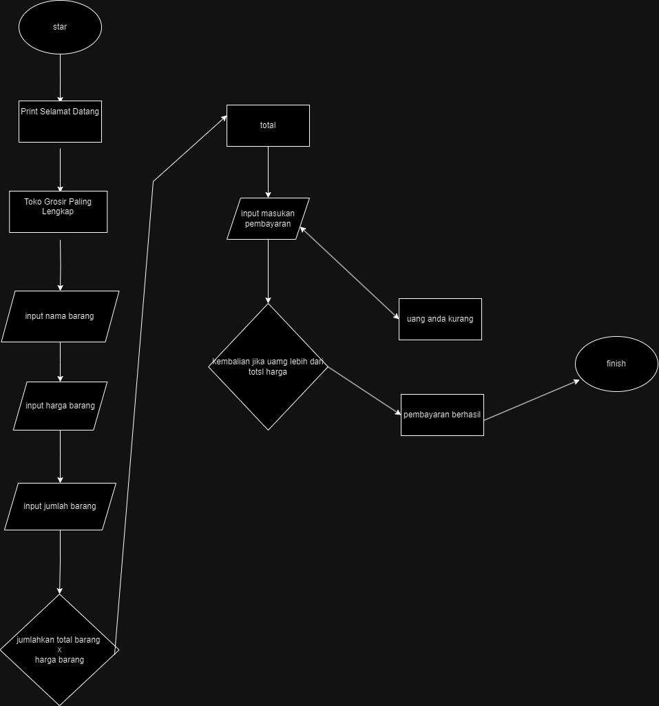

## KASIR SEBUAH TOKO
# STUDI KASUS
SEBUAH TOKO MENJUAL BERBAGAI MACAM BARANG DENGAN HARGA YANG BERBEDA,
NAMUN TOKO VEBYMART BELUM MEMPUNYA PROGRAM KASIR
# SOLUSI
JADI VEBY MEMBUAT PROGRAM KASIR YANG BISA MENGHITUNG TOTAL 
BELANJA COSTUMER BERDASARKAN HARGA DAN JUMLAH
## FLOWCHART
